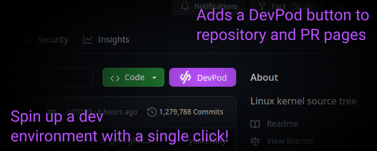
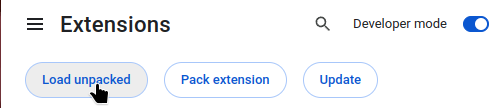

# Clone with DevPod Button Browser Extension

This is a browser extension for DevPod that adds a button to clone and open a
repository with [DevPod](https://devpod.sh). Install DevPod and this extension,
and you'll have a convenient button to clone repositories into clean development
environments!

This extension does not access your repositories or collect any private
information. It just figures out the right repository and branch name, and sends
you to [devpod.sh/open](https://devpod.sh/open) when you click the button.

## Features

- Adds a DevPod button on **Github** and **GitLab**
  - On the main repository page
  - When exploring branches
  - On PRs

## Installation

The Chrome extension store, Edge extension store, and Firefox extension store are in review.

In the meantime, you can download and load the extension in developer mode.
Download the latest `dev-ext-browser-x.y.z.zip` file from the
[releases](https://github.com/SeriousBug/devpod-browser-extension/releases) page
and unzip it. Download the `-chrome-` version for Chrome, Vivaldi, or Edge.
Download `-firefox-` for Firefox.

Then in the extension settings, enable developer mode and click
"Load unpacked". Select the unzipped folder, and your extension is ready to use.

## Roadmap

- [ ] Action button support
- [ ] Support more platforms
  - [ ] Gitea & Forgejo
  - [ ] sourcehut
  - [ ] Bitbucket
- [ ] Add configurable settings

Have any suggestions? [Open an issue](https://github.com/SeriousBug/devpod-browser-extension/issues) and I'll do my best to work on it.

## Build

To build the extension yourself, you'll need NodeJS 22 or later. Run `npm install` to install the dependencies, then `npm run build` to build the
extension. You should get two files, `devpod-ext-chrome-x.y.z.zip` and `devpod-ext-firefox.x.y.z.zip`.

## Develop

Contributions are welcome! To develop the extension, using NodeJS 22 or later run `npm install`, then `npm run dev`. This will start the development server, and try to launch Chrome using a clean profile and with the extension preloaded.

You can develop the extension inside a devcontainer, a devcontainer
configuration is provided. However, the browser launch won't work and
auto-reload also does not seem to function properly. If you can figure out these
issues, please let me know!

## Disclaimer

This browser extension is not an official DevPod project. It is not affiliated
with Loft Labs, Inc. The DevPod trademark is owned by Loft Labs, Inc.

This extension is also not affiliated with Github, Gitlab, Gitea, Forgejo, or
any other forge software company.
